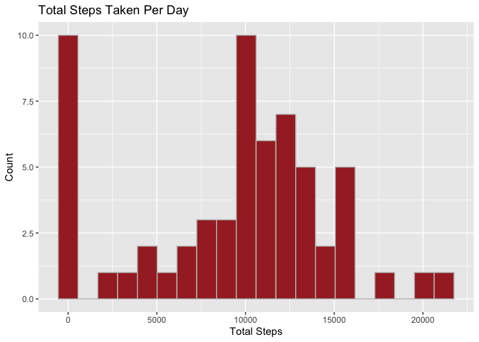
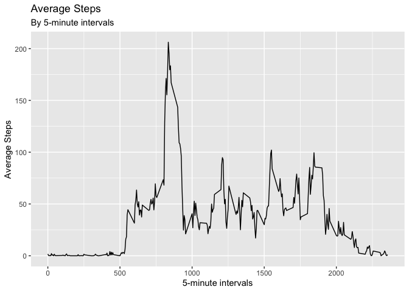
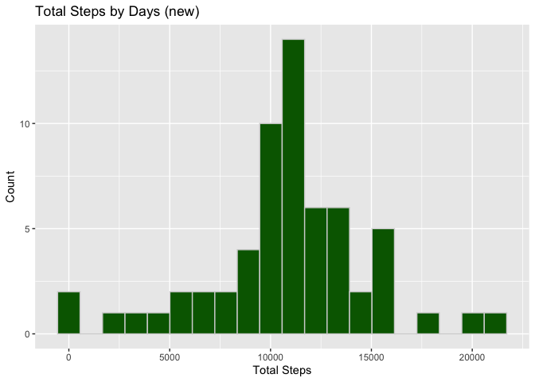
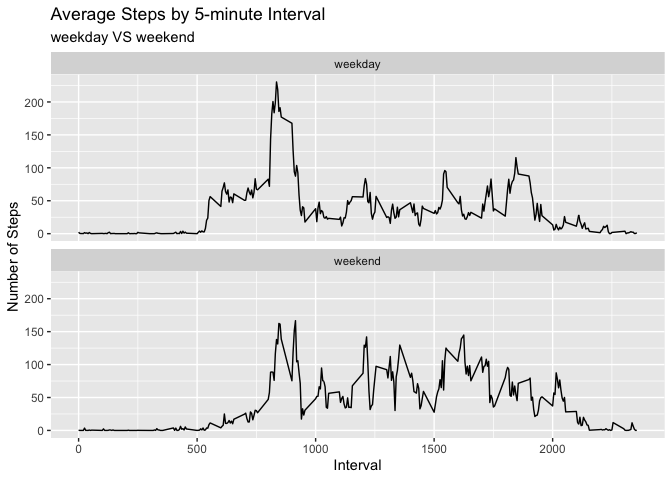

---
output:
  html_document: 
    keep_md: yes
---
# Reproducible Research Course Project 1
***  
  
### Prepare  

**1. Loading packages and Setting Global Options**


```r
library(tidyverse)
```

```
## ── Attaching packages ─────────────────────────────────────── tidyverse 1.3.2 ──
## ✔ ggplot2 3.3.6      ✔ purrr   0.3.5 
## ✔ tibble  3.1.8      ✔ dplyr   1.0.10
## ✔ tidyr   1.2.1      ✔ stringr 1.4.1 
## ✔ readr   2.1.3      ✔ forcats 0.5.2 
## ── Conflicts ────────────────────────────────────────── tidyverse_conflicts() ──
## ✖ dplyr::filter() masks stats::filter()
## ✖ dplyr::lag()    masks stats::lag()
```

```r
library(knitr)

knitr::opts_chunk$set(echo = TRUE)
```
  
  
**2. Loading and pre-processing the data**


```r
unzip("activity.zip")
activity <- read.csv("activity.csv")
```
  
  
### Question 1: What is mean total number of steps taken per day?
  
**1. Calculate the total steps per day**


```r
daily_steps <- activity %>% 
        group_by(date) %>% 
        summarize(total_steps=sum(steps, na.rm=TRUE))
```
  
      
**2. Create a histogram of the total steps taken per day**  


```r
ggplot(data=daily_steps, aes(total_steps))+
        geom_histogram(bins=20, fill="brown",col="grey")+
        labs(title="Total Steps Taken Per Day", x="Total Steps", y="Count")
```

<!-- -->
  
  
**3. Calculate the mean and median of the total steps taken per day**


```r
summary(daily_steps$total_steps)
```

```
##    Min. 1st Qu.  Median    Mean 3rd Qu.    Max. 
##       0    6778   10395    9354   12811   21194
```

**So the mean of total steps taken per day is 9354, and the median is 10395.**  
  
     
### Question 2: What is the average daily activity pattern?  
  
  
**1. Calculate the average steps taken by the 5-minute intervals**


```r
ave_steps <- activity %>% 
        group_by(interval) %>% 
        summarize(mean_steps=round(mean(steps, na.rm=TRUE),1))
```
  
  
**2. Make a line plot of the average steps taken by the 5-minute intervals**


```r
ggplot(data=ave_steps, aes(x=interval, y=mean_steps))+
        geom_line()+
        labs(title="Average Steps", subtitle="By 5-minute intervals", x="5-minute intervals", y="Average Steps")
```

<!-- -->
  
  
**3. Check for the 5-minute interval which contains the maximum number of steps.**


```r
ave_steps[ave_steps$mean_steps==max(ave_steps$mean_steps),]
```

```
## # A tibble: 1 × 2
##   interval mean_steps
##      <int>      <dbl>
## 1      835       206.
```

**So the interval 835 contains the maximum number of steps.**  
  
  
### Question 3: Imputing missing values
  
  
**1. Calculate the total number of missing values**


```r
colSums(is.na(activity))
```

```
##    steps     date interval 
##     2304        0        0
```

**There are 2304 missing values in the column of "steps".**
  
  
**2. Impute the missing values with the mean of the corresponding 5-minute interval**


```r
new_activity <- activity %>% 
        mutate(steps=ifelse(is.na(activity$steps) & activity$interval==ave_steps$interval, ave_steps$mean_steps, activity$steps))
```
  
  
**3. Create a histogram of the new total steps taken per day** 


```r
new_activity %>% 
        group_by(date) %>% 
        summarize(sum_steps=sum(steps)) %>% 
        ggplot(aes(sum_steps))+
        geom_histogram(bins=20, fill="darkgreen",col="lightgrey")+
        labs(title="Total Steps by Days (new)", x="Total Steps", y="Count")
```

<!-- -->
  
  
**4. Calculate the new mean and median value of total steps taken per day**


```r
new_activity %>% 
        group_by(date) %>% 
        summarize(sum_steps=sum(steps)) %>% 
        summary(sum_steps)
```

```
##      date             sum_steps    
##  Length:61          Min.   :   41  
##  Class :character   1st Qu.: 9819  
##  Mode  :character   Median :10766  
##                     Mean   :10766  
##                     3rd Qu.:12811  
##                     Max.   :21194
```

**The mean and median value of total steps taken per day become equal now, both are 10766. It seems that imputing missing value made the data close to normal distribution.**
  
  
### Question 4: Are there differences in activity patterns between weekdays and weekends?
  
  
**1. Create a new factor variable with two levels -- "weekday" and "weekend"**


```r
new_activity$date <- as.Date(new_activity$date, "%Y-%m-%d")

new_activity <- new_activity %>% 
        mutate(weekdays=ifelse(weekdays(date) %in% c("Saturday", "Sunday"), "weekend", "weekday"))

new_activity$weekdays <- as.factor(new_activity$weekdays)
```
  
  
**2. Make a line plot comparing the activity patterns between weekday and weekends**


```r
new_activity %>% 
        group_by(interval, weekdays) %>% 
        summarize(average_steps=mean(steps), .groups = 'drop') %>% 
        ggplot(aes(x=interval, y=average_steps))+
        geom_line()+
        facet_wrap(~weekdays, nrow=2)+
        labs(title="Average Steps by 5-minute Interval", subtitle="weekday VS weekend", x="Interval", y="Number of Steps")
```

<!-- -->

